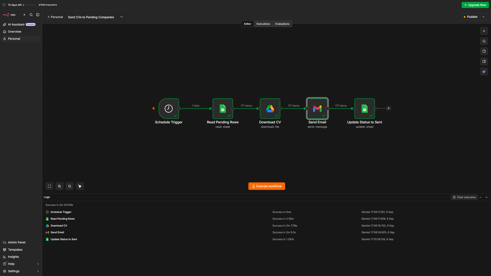

# Automated Job Application & CV Dispatcher (n8n Workflow)

An automated workflow built with **n8n** that streamlines the job application process by scanning job leads from Google Sheets, dynamically fetching CVs from Google Drive, sending personalized emails via Gmail, and updating application statuses in real-time.

---

## 📸 Workflow Preview

---

## ✨ Features

* **Smart Filtering:** Fetches only lead entries marked with `Pending` status to prevent duplicate email dispatches.
* **Automated Asset Retrieval:** Securely fetches the latest CV file directly from Google Drive.
* **Email Automation:** Sends personalized applications with attached CVs using Gmail integration.
* **Status Syncing:** Automatically updates the lead status in Google Sheets from `Pending` to `Sent` after each successful dispatch.
* **Background Scheduling:** Scheduled to run autonomously on a daily basis via `Schedule Trigger`.

---

## 🛠️ Tech Stack & Integrations

* **Orchestration:** n8n
* **Database / Tracking:** Google Sheets API
* **File Storage:** Google Drive API
* **Email Service:** Gmail API

---

## 📋 Google Sheet Structure Requirement

To run this workflow successfully, your Google Sheet should contain the following column headers:

| Company | Company Email | Status |
| :--- | :--- | :--- |
| Example Co. | hr@example.com | Pending |

---

## 🚀 How to Import & Use

1. **Clone or Download** this repository.
2. Open your **n8n** instance.
3. Create a new workflow, click on the **menu (top right)** -> **Import from File**, and select `workflow.json`.
4. Connect your credentials for:
   * **Google Sheets API**
   * **Google Drive API**
   * **Gmail API**
5. Update the **Sheet ID** and **Drive File ID** parameters with your own.
6. Click **Publish** to enable background execution.

---

## 🔒 Security & Privacy Note

This repository contains only the structural workflow layout (`.json`). All sensitive OAuth tokens, API keys, personal email addresses, and private sheet identifiers have been removed or replaced with placeholder values.
